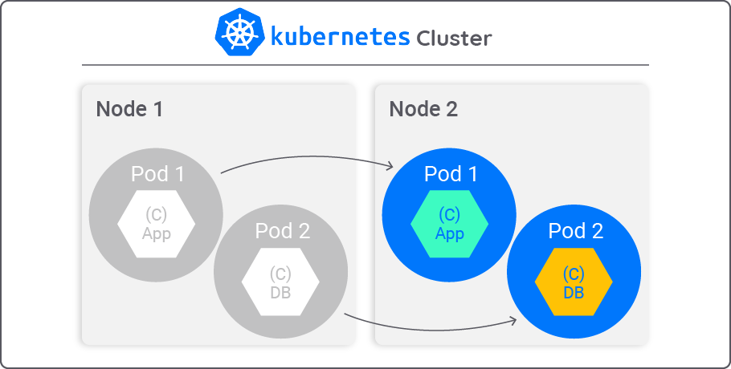

# 🐳 Deploying FastAPI Web App with Kubernetes

This repository contains a tutorial on how to deploy a FastAPI web app using Kubernetes.

📌 Goals:
--------------------
- [x] Learn fundamentals of Kubernetes.
- [x] Practice kubernetes commands and yaml files with minikube.
- [x] Learn how to deploy a FastAPI web app using Kubernetes.

📖 Tutorial
--------------------

### Prerequisites

- 🛠️ **Tools & Technologies**: 
    - [Docker](https://www.docker.com/)
    - [Minikube](https://minikube.sigs.k8s.io/docs/)

🛠️ Setting Up:
--------------------

- 🐳 **Docker Image**:
    - Please follow the instructions in my other [repository](
        https://github.com/firattamur/fastapi-docker-ci-app
    ) to create a Docker image for the FastAPI web app.
    
    - You can also use the Docker image I created and pushed to Docker Hub:
        - `ftamur/fastapi-docker-ci-app:v1.0.1`

- ⚙️ **Installation**: 

    - Install Docker: https://docs.docker.com/get-docker/
        - Docker is a set of platform as a service (PaaS) products that use OS-level virtualization to deliver software in packages called containers. 
        - Containers are isolated from one another and bundle their own software, libraries and configuration files; they can communicate with each other through well-defined channels.

    - Install Minikube: https://minikube.sigs.k8s.io/docs/start/
        - Minikube is a tool that makes it easy to run Kubernetes locally. A single-node Kubernetes cluster is created using a virtual machine (VM) on your local machine or with docker containers.

    - Install kubectl: https://kubernetes.io/docs/tasks/tools/install-kubectl/
        - kubectl is a command line tool for controlling Kubernetes clusters.


📚 Kubernetes Fundamentals:
--------------------

- **Kubernetes**: Kubernetes is an open-source container-orchestration system for automating computer application deployment, scaling, and management.
    - It was originally designed by Google and is now maintained by the Cloud Native Computing Foundation.
    - It aims to provide a "platform for automating deployment, scaling, and operations of application containers across clusters of hosts".
    - It works with a range of container tools, including Docker.
    - Many cloud services offer a Kubernetes-based platform or infrastructure as a service (PaaS or IaaS) on which Kubernetes can be deployed as a platform-providing service.
    - Many vendors also provide their own branded Kubernetes distributions.



- **Nodes**: A node is a worker machine in Kubernetes.
    - A node may be a VM or physical machine, depending on the cluster.
    - Each node contains the services necessary to run pods and is managed by the master components.
    - The services on a node include the container runtime, kubelet and kube-proxy.

- **Pods**: Pods are the smallest deployable units of computing that can be created and managed in Kubernetes.
    - In Docker, smallest unit is a container. In Kubernetes, smallest unit is a pod.
    - A Pod (as in a pod of whales or pea pod) is a group of one or more containers, with shared storage and network resources, and a specification for how to run the containers.
    - In general, 1 Pod contains 1 application container. But there are cases where a Pod can contain multiple containers.
    - A Pod's contents are always co-located and co-scheduled, and run in a shared context.
    - A Pod models an application-specific "logical host": it contains one or more application containers which are relatively tightly coupled.
    - In non-cloud contexts, applications executed on the same physical or virtual machine are analogous to cloud applications executed on the same logical host.
    - In Kubernetes, Pods are the atomic unit of scheduling.
    - Pods are created, scheduled, and managed by the Kubernetes control plane.

- **Deployments**: A Deployment provides declarative updates for Pods and ReplicaSets.
    - You describe a desired state in a Deployment, and the Deployment Controller changes the actual state to the desired state at a controlled rate.
    - You can define Deployments to create new ReplicaSets, or to remove existing Deployments and adopt all their resources with new Deployments.
    
- **Services**: An abstract way to expose an application running on a set of Pods as a network service.
    - With Kubernetes you don't need to modify your application to use an unfamiliar service discovery mechanism.
    - Kubernetes gives Pods their own IP addresses and a single DNS name for a set of Pods, and can load-balance across them.
    - A Service in Kubernetes is an abstraction which defines a logical set of Pods and a policy by which to access them.
    - Services enable a loose coupling between dependent Pods.
    - A Service is defined using YAML (preferred) or JSON, like all Kubernetes objects.
    - Services are an abstraction that defines a logical set of Pods and a policy by which to access them (sometimes this pattern is called a micro-service).
    - The set of Pods targeted by a Service is (usually) determined by a selector.
    - Kubernetes provides two modes of service discovery:
        - Environment variables
        - DNS


🔧 Kubernetes Commands:
--------------------

- Start Minikube:
    ```bash
    minikube start
    ```

    - Output should be similar to:
        ```bash
        😄  minikube v1.23.2 on Darwin 11.6 (arm64)
        ✨  Automatically selected the docker driver. Other choices: hyperkit, ssh
        👍  Starting control plane node minikube in cluster minikube
        🚜  Pulling base image ...
        🔄  Restarting existing docker container for "minikube" ...
        🐳  Preparing Kubernetes v1.22.2 on Docker 20.10.8 ...
        🔎  Verifying Kubernetes components...
        🌟  Enabled addons: storage-provisioner, default-storageclass
        🏄  Done! kubectl is now configured to use "minikube" cluster and "default" namespace by default
        ```

- Check Minikube status:
    ```bash
    minikube status
    ```

    - Output should be similar to:
        ```bash
        minikube
        type: Control Plane
        host: Running
        kubelet: Running
        apiserver: Running
        kubeconfig: Configured
        ```

- Check Kubernetes nodes:
    ```bash
    kubectl get nodes
    ```

    - Output should be similar to:
        ```bash
        NAME       STATUS   ROLES           AGE   VERSION
        minikube   Ready    control-plane   19h   v1.28.3
        ```
🚀 Deploying FastAPI Web App
--------------------

### Creating Kubernetes Deployment
1. **Define Deployment**: Explain how to create a deployment YAML file for your Docker image.
2. **Deploy**: Guide users through deploying the YAML file using `kubectl`.
3. **Verification**: Show how to verify if the deployment was successful.

### Creating Kubernetes Service
1. **Define Service**: Explain how to create a service YAML file for your deployment.
2. **Deploy**: Guide users through deploying the YAML file using `kubectl`.
3. **Verification**: Show how to verify if the service was successful.

### Scaling the Application
- 📈 **Scaling**: Provide instructions on how to scale the application using Kubernetes.

